# Mycelia

An ecological real-time strategy game with a living forest and a quiet, organic interface.
You wake as a fungal intelligence in a single spore beneath a forest floor, grow
a mycelial network through living soil, form symbioses with tree roots, and
fruit before the forest fails.

The full design brief is in [`mycelium-rts-outline-spec.md`](mycelium-rts-outline-spec.md).
The visual system the build commits to is in [`DESIGN.md`](DESIGN.md), and the
product record is in [`PRODUCT.md`](PRODUCT.md).

The authoritative implementation status, feature register, priorities, known
limitations, and verification record are in [`PROJECT_STATUS.md`](PROJECT_STATUS.md).
Future work must be recorded there rather than in separate plans or handoffs.

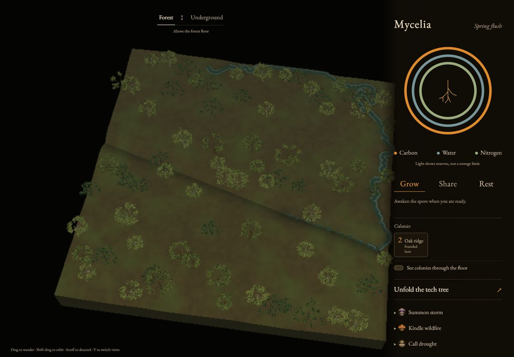

## How to play

You are a fungus. You start as one spore under a stand of trees, in one of the
nine stands of a forested valley. You spread a network of strands through the
soil and trade with the trees above. Then you spread across the region and
hold it against a rival network. Every game has a fresh seed, so the forest,
the soil and the starting stands change each time.

### 1. Wake up and look around

The game opens on the forest from above. Drag to look around, scroll to zoom,
and click a crown to see a tree. When you are ready, press **Awaken the spore**.
Press **V**, or scroll in close, to go **Underground**. That view is a cut
through the soil: the root systems of the trees above, the water table below,
and your colony, glowing amber.

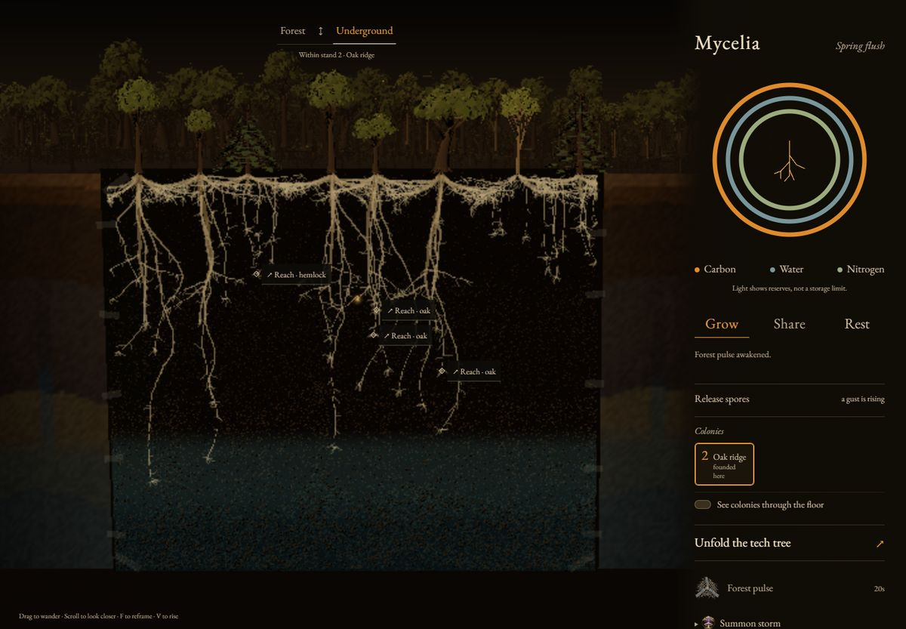

### 2. Grow, and pay for every centimetre

Everything you do costs one of three resources. The three rings in the side
panel show how much you hold:

- **carbon** (amber) is sugar from the trees, and the fuel for everything;
- **water** (slate) and **nitrogen** (sage) come from the soil your strands
  sit in.

Choose an order, then click the soil:

- **Grow** (`1`) sends your growing tips toward that point. Growth costs
  carbon, and hard or dry soil costs more.
- **Share** (`2`; called Bond in the keys) forms a partnership with a tree
  through one of its root tips. The tree then sends you carbon, and you must keep it supplied with
  water and minerals. A tree you neglect breaks the bond.
- **Cord** (`3`) thickens a strand into a cord. Cords move resources faster
  and survive fire and fighting, but they cost more to keep.
- **Fruit** (`4`) raises a mushroom once you have saved enough surplus.

**Rest** (`R`) stops growth so carbon can build up. Your first bond is the turning point: each tree
you feed lets you grow more tips at once. A network that grows into poor soil
without a partner starves and shrinks.

### 3. Fruit, and send spores on the wind

When enough carbon is saved, **Fruit** raises a mushroom through the soil to
the forest floor. A finished mushroom holds spores. Wait for a gust, then press
**Release spores**: the wind carries them to another stand, where they found a
new colony of your own. You can also grow straight across a stand's edge:
click the soil beyond it with **Grow**, or use **Follow the frontier** to keep
the camera on the growing edge.

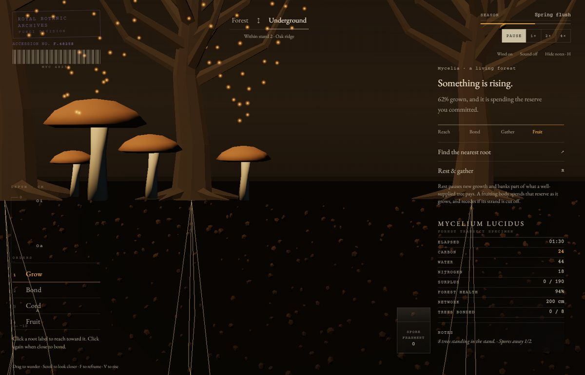

Each colony keeps its own resources. Colonies of yours that touch fuse into
one network. A tile for each colony appears in the side panel, and clicking it
takes you below. **See colonies through the floor** shows all your networks
from the forest view, and the trees you hold glow softly.

### 4. Learn, and use the powers

Open **Unfold the tech tree**. Adaptations unlock as you reach milestones, and
you learn them for free. There are three branches:

- **Exchange**: soil water and nitrogen come in faster.
- **Resilience**: fed strands heal, and transport along cords is faster.
- **Fruiting**: surplus is saved toward mushrooms, and mushrooms mature
  faster.

After your first mushroom, each finished branch also gives a short power:
**Forest pulse**, **Mend the web** and **Second spring**.

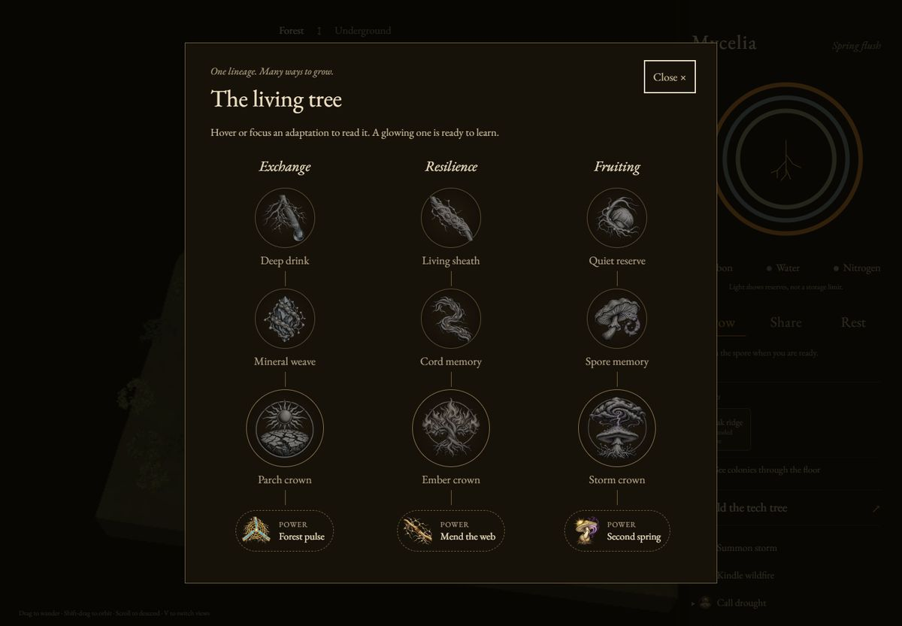

The top of each branch is an ecological power that changes the whole region,
for every colony, including yours:

- **Summon storm** (Storm crown). You choose its direction. Rain, lightning
  and falling trees follow, and fruiting and spores travel further on the
  wind.
- **Kindle wildfire** (Ember crown). You choose which way the fire runs.
  Trees your network keeps watered survive; dry ones burn. Deep cords live
  through it, and the ash that follows makes mushrooms mature faster. Burned
  trees rot into the soil over the next few minutes.
- **Call drought** (Parch crown). The rain stops across the region. Unfed
  trees wither and shallow strands dry out; the ground near the stream holds.

| Storm | Wildfire |
|---|---|
| 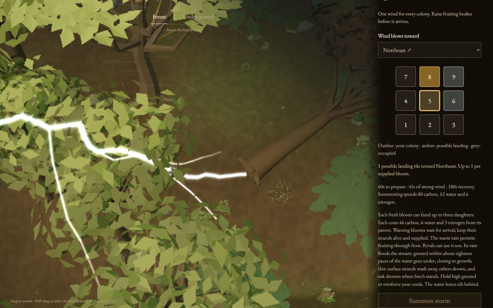 | 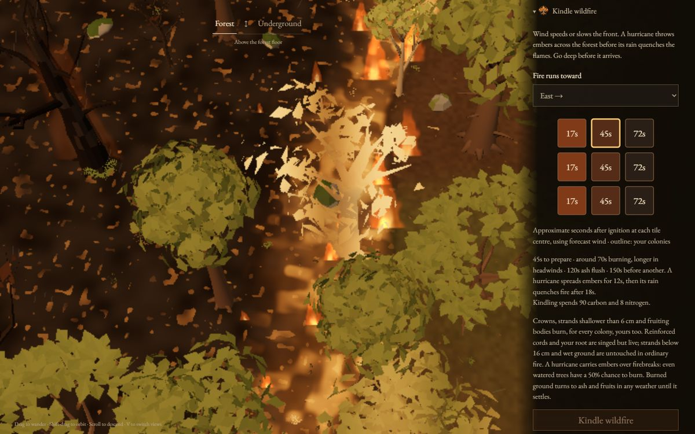 |
| **Drought** | **Flood** |
| 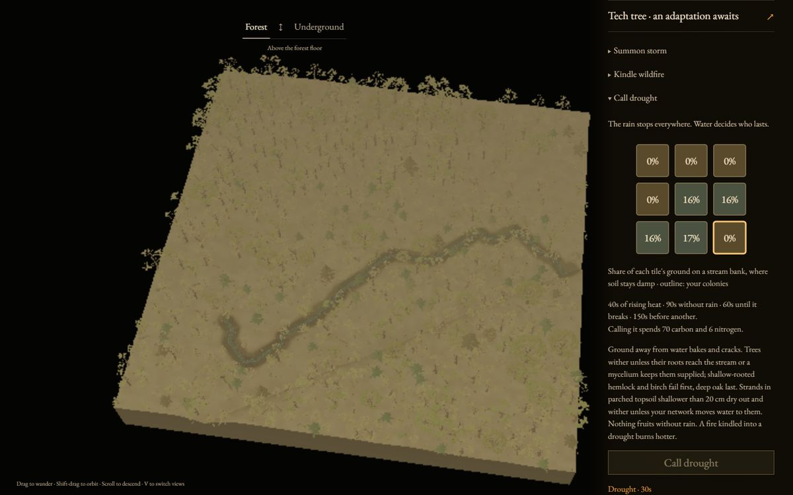 | 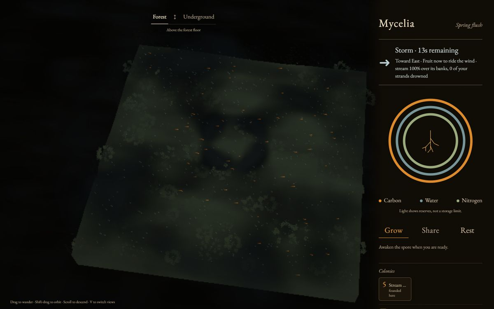 |

### 5. Fight at the front

A rival fungus lives in another stand. Where its strands touch yours, a
**front** opens and the two networks fight. A banner names the stand, and `Z`
takes you there. Your strands at the front spend their own carbon to dissolve
the enemy's, so the side that keeps its front supplied wins. Cut a strand and
everything beyond it starves. Reach an enemy's founding strand and the whole
colony dies.

You can also fight directly. Point at the enemy's strands and press a key; the
chemical is paid for from your strands nearby:

| Key | Chemical | Cost | Use it for |
|---|---|---|---|
| `Q` | Lysing enzymes | carbon | Quick bursts on fine strands. Spam it. |
| `W` | Leachate | water | A poison that lingers in wet soil. |
| `E` | Ammonia | nitrogen | Damage, and strips nitrogen from enemy strands. |
| `A` | Oxalate burst | carbon + nitrogen | A heavy blast that cuts through cords. |
| `D` | Coil | all three | Kills the thickest enemy strand in reach, cutting off what lies beyond it. |
| `C` | Barrage | carbon + water | A dark wall: your strands inside take far less damage. |

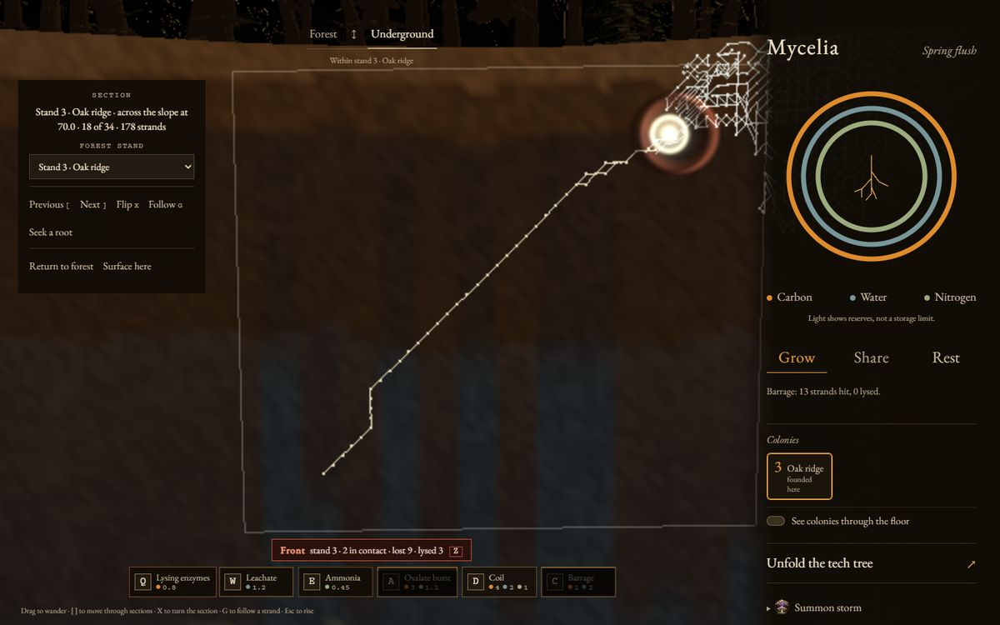

Under **Opponent** in the side panel you choose who plays the rival:

- a simple built-in bot;
- an offline heuristic agent;
- an AI decision model (TypeSafe Jev, or OpenAI Decisions once it is
  available), which makes about four decisions a second.

### 6. Win the region

A stand counts as yours when you hold more of its trees in partnership than
the rival does. Hold **5 of the 9 stands** until the season changes, and the
region is yours. If the rival does the same, you lose. **Survey the region**
(`S`) lists what every stand holds.

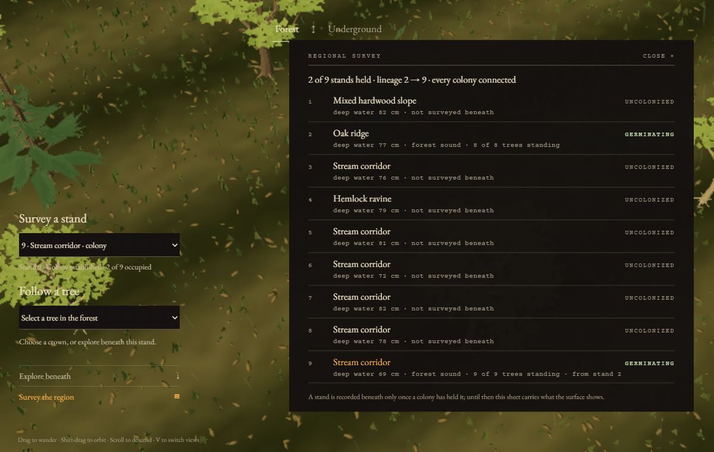

### Handy moves

- **Split your network.** Hold the mouse still on the soil to draw a circle,
  and the strands inside become a subcluster you can order separately. The
  number keys then pick a subcluster.
- **Pause and change speed.** Space pauses; the speed buttons run from
  1× to 4×.
- **Sections.** In a regional colony, `[` and `]` move through cross-sections
  of the soil and continue into adjacent stands. Drag along a section to follow
  the same cut through a stand boundary; `X` turns the cut, and `G` follows a
  strand. Return to forest rises to the saved view, while Surface here rises
  over the stand below.
- **Watch the seasons.** Mushrooms only rise in warm, wet weather, which
  means spring and autumn. Summer is too dry and winter too cold, unless a
  storm or the ash after a fire changes the weather. Autumn also drops leaf
  litter that feeds the soil.

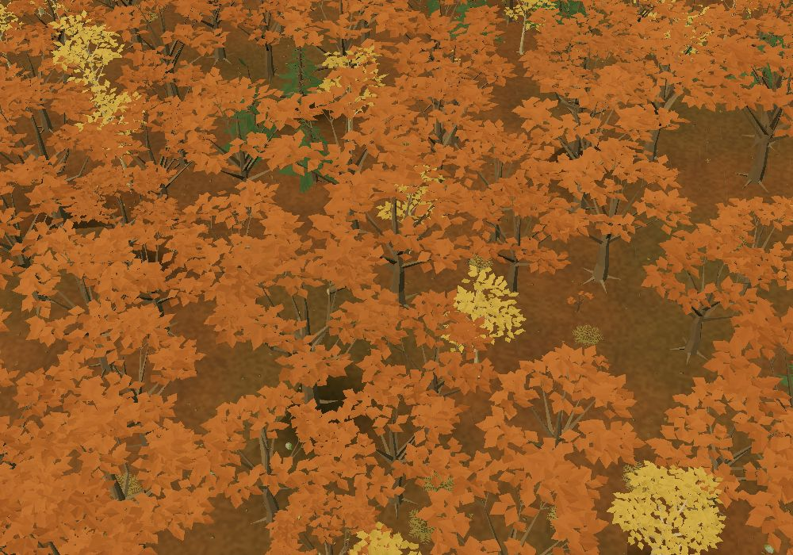

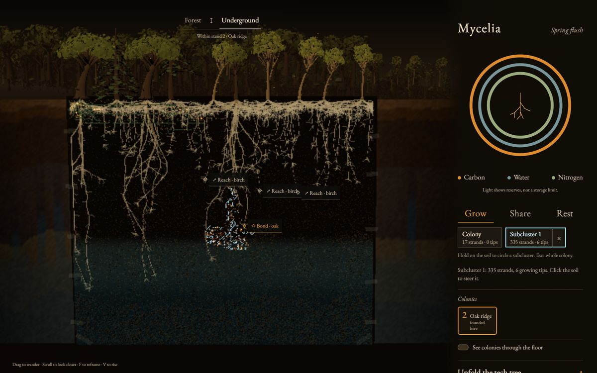

## Running it

```bash
npm install
npm run dev        # http://127.0.0.1:5173
```

```bash
npm run typecheck  # tsc --noEmit
npm run build      # static bundle in dist/
npm run preview    # serve the built bundle
```

## Deploying to Cloudflare Pages

The whole game is a static bundle, so Pages hosts it for free at any traffic
level. There is no server, no database and no API: the simulation runs entirely
in the browser.

```bash
npx wrangler login     # once, to authorise the CLI
npm run deploy         # builds, then `wrangler pages deploy`
```

`wrangler.jsonc` names the project `mycelia` and points Pages at `dist/`. The
first `deploy` creates the project; after that the same command publishes a new
version. You can also connect the repository in the Cloudflare dashboard and let
Pages build it — use `npm run build` as the build command and `dist` as the
output directory.

Nothing here needs Workers KV, D1, R2 or Durable Objects yet. Saved games and
multiplayer remain deferred in `PROJECT_STATUS.md`.

## How it is put together

```
src/sim/      the whole game, headless and deterministic
src/render/   Three.js presentation of simulation state
src/ui/       the printed interface (semantic HTML, not canvas text)
src/game.ts   the loop that joins them
public/       authored 3D models, served beside the bundle
tools/        visual QA harness and the Blender asset builder
design/       the approved composition comps and QA screenshots
```

**The simulation is the source of truth.** Nothing in `src/sim/` imports
Three.js, reads a DOM node, or calls `Math.random`. It advances on a fixed 1/60s
timestep from a seeded PRNG, so a match is reproducible from its seed plus the
orders the player gave — which is what makes replays and lockstep multiplayer
possible later without redesigning anything.

**Rendering reads state; it never owns it.** Soil colour comes from stratum,
moisture, organic content and how much network is packed into each cell. A
strand's brightness comes from its thickness, health and actual resource flow.
Motes only appear on edges that moved carbon this tick, so the drifting light is
a readout of the economy rather than an ambient effect.

**The interface uses semantic HTML.** Three complete rings show the strength of
connected reserves, with exact amounts on hover or focus. Grow, Share and Rest
lead; open the disclosures for Cord, Fruit, forest exploration and readings.
Unfold the tech tree to learn milestone-earned adaptations across Exchange,
Resilience and Fruiting. All branches belong to the same fungal network.
After the first bloom, completed branches unlock contextual powers: Forest
pulse, Mend the web and Second spring. Each runs for twenty seconds with a
two-minute cooldown from activation.

**Surface art is optional by construction.** `src/render/assets.ts` loads the
glTF models listed in `public/assets/`, scales each one to the simulation's own
tree, corrects it onto the ground, and falls back to generated geometry whenever
a file is missing, so art can arrive one model at a time without the game
depending on it. `tools/make-placeholder-assets.py` rebuilds the current
placeholder set in Blender 4.2, and the conventions a model has to follow are
written down under "Authored 3D assets" in `DESIGN.md`.

## Controls

| Input | Action |
|---|---|
| Drag | Pan the current view |
| Shift-drag | Orbit the forest / tilt the underground specimen |
| Scroll | Zoom; descending close enough enters the underground view |
| `V` | Switch between Forest and Underground |
| Arrow keys | Pan while the canvas is focused |
| `+` / `−` | Zoom while the canvas is focused |
| `F` | Reframe the current view |
| Space | Pause or resume |
| `R` | Rest or resume growth after awakening |
| `H` | Hide or restore field notes |
| `S` | Open or close the regional survey |
| `1`–`4` | Grow / Bond / Cord / Fruit |
| `[` / `]` / `X` / `G` | Previous / next section, flip orientation, follow a strand in a regional section |
| `N` | Toggle the forest Network projection when a spatial colony is present |
| `Q` `W` `E` | Light chemicals at the cursor, underground: lysing enzymes, leachate, ammonia |
| `A` `D` `C` | Heavy chemicals at the cursor: oxalate burst, coil, barrage |
| `Z` | Jump to the busiest front |

Click the sheet to apply the selected order. With **Bond** selected, click a
root tip to form a symbiosis; a bonded tree ships carbon in exchange for water
and minerals, and severs the bond if it goes unsupplied for too long.

The region's stream crosses the forest as a band of water. Underground it is a
threshold rather than a wall: hyphae cannot grow into the open channel, the soil
beneath its bed is still passable, and the bank beside it is the wettest ground
in the stand, so a network that reaches the stream drinks from it rather than
crossing it. **Grow** tells you which of the two it met if an order is refused.

Use **Survey a stand** in the forest to select a community. **Explore beneath**
opens an underground section in any of the nine stands, even before it holds a
colony; the section's **Forest stand** selector moves directly between them.
Selecting a crown follows that tree's roots in an occupied stand. Fruiting
can send a paid spore to another stand. The daughter starts its own network on
the same regional soil, with no physical or resource link to its parent.
All colonized stands keep running while you explore, and orders and resource
figures belong to the stand currently underground. After a local outcome,
**Explore daughter stands** continues the regional lineage when another colony
exists. A regional victory condition is still being designed.

**Grow through a stand edge** in the forest directs the selected colony toward a
passable neighboring stand. Its existing network becomes one regional body with
one resource inventory; its strands keep their physical positions when regional
growth begins. Crossing the edge is growth, not spore founding. The
underground **Section** controls browse that body. A spore daughter gets its own
spatial body and can be selected and directed separately. **Seek a root** directs growth
toward an unbonded partner in the open stand, or bonds when a strand is close
enough. **Return to forest** restores the view from which you descended;
**Network** then projects the same strands over the ground, and selecting one
opens its section. Flip a section and click **Grow** to steer toward a passable
point in any horizontal direction or depth; the frontier checks the intervening
3D soil as it goes. Comparing two sections at once remains in development.

**Survey the region** (or `S`) opens a printed ledger of all nine stands: what
each one holds, its water, its broad forest health once a colony has held it, and
how the lineage connects back to the founding stand. A stand that has never been
held is printed as not yet surveyed beneath, because nobody has been down there
to record it. Choosing a line selects that stand, the same as the selector
above.

## Demo and QA parameters

Append to the URL:

| Parameter | Effect |
|---|---|
| `?seed=old-growth` | Generate a named map instead of the default |
| `?warm=300` | Fast-forward 300 simulated seconds before the first frame |
| `?steward=1` | A stand-in player that bonds every tree it can reach |
| `?qa=fast` | Opt into the fast visual-QA rendering preset |

The seed, warm-up and steward are deterministic, so a link like
`?seed=raven-wood&warm=300&steward=1` always opens the same grown match.

## Visual QA

The botanical GLB pack can be rebuilt locally with Blender 4.2 (no external
assets or add-ons). In PowerShell:

```powershell
& 'C:/Program Files/Blender Foundation/Blender 4.2/blender.exe' --background --factory-startup --python-exit-code 1 --python tools/make-forest-assets.py -- --render
npm run test:assets
```

This writes the assets and manifest to `public/assets/`, plus tree, LOD and prop
preview sheets to ignored `design/shots/`. `--output <directory>` builds an
isolated copy. The six existing game paths use the new art; additional props,
dead variants and crown anchors await runtime integration. Each tree selects its
LOD tier from its own projected size on screen. The asset contract is in
`DESIGN.md` and remaining integration work is in `PROJECT_STATUS.md`.

```bash
npm test            # headless simulation regression
node tools/test-region.mjs  # the regional world: terrain, water, spores
npm run test:navigation -- --qa fast # regional travel and order isolation
npm run test:batches # shared tree draws, transforms, colours and IDs
npm run profile:forest -- --qa fast # bounded software-WebGL measurements
npm run test:lod    # projected-size LOD selection: bands, hysteresis
npm run test:view   # browser checks for the forest <-> underground crossing
npm run test:journey # plays a whole match through the printed controls
npm run test:regional-spatial # builds and checks a natural seam crossing in the browser
node tools/shoot.mjs \
  --url "http://127.0.0.1:5173/?warm=300&steward=1" \
  --canvas-out design/shots/latest.png \
  --eval "window.mycelia.game.sim.player.tipCount"
```

For a direct, paused feature fixture, run `npm run dev` and open
`http://localhost:5173/?lab=water` (add `&qa=fast` for cheaper rendering).
The **Test specimen** bench switches between water, forest, a region with all
stands funded, 30 seconds of steward-assisted growth, and the crossing fixture
that grows one colony across a stand boundary. It includes a live water-depth
slider and a ten-second fixed-step advance. These are explicitly synthetic
fixtures; ordinary URLs keep the normal opening and economy.

Going **Underground** opens a vertical section through the selected stand, and
the sheet carries a **Section** panel with **Previous**,
**Next**, **Flip**, **Follow**, **Seek a root**, **Return to forest**, **Surface here** and a stand selector - or
`[`, `]`, `X`, `G` and `Escape` on the keyboard. The panel names the stand, the
community, the orientation, the position in the family and the strand count, and
says plainly when a section holds no network.

**Network** in the forest panel projects the colony's actual strands over the
terrain, and clicking a projected strand opens the section through it. A crown
still wins a click. Empty stands show a section without inventing strands.

In the forest scene the bench also carries the dressing controls: background
vegetation on, off, or at the medium and dense trial bands, and a community
selector that isolates one stand so its own planting can be inspected. That
scenery is presentation only - the playable trees, the selector and every order
behave exactly as they do with it switched off.
Scene changes reload the seed for repeatable comparisons. Close the disclosure
when reviewing the artwork, or use **Exit testing** to return to a normal game.

```bash
npm run test:feature -- --list          # all feature suites
npm run test:feature -- water           # sub-second hydrology checks
npm run test:feature -- water --browser # rebuild + focused browser check
npm run test:feature -- water --browser --normal # full-quality water check
npm run test:feature -- spatial         # coordinates and the shared soil volume
npm run test:feature -- crossing        # one colony across one stand edge
npm run test:regional-mature -- --qa fast # independent spore daughter and nine-tile browser controls
npm run test:feature -- dressing         # background planting; add --browser for the renderer check
npm run test:feature -- sections         # sections and the reveal; add --browser for the renderer check
npm run test:feature -- views           # rebuild + fast view smoke
npm run test:feature -- views --full    # complete view regression
```

The same dispatcher covers simulation, region, LOD, batches, assets,
navigation and the full player journey. It runs headless checks where available;
browser runs rebuild first and default to fast quality. Complete simulation,
navigation and journey suites still take longer than the focused water check.

For fast iteration under software WebGL, pass `--qa fast` to any browser tool
(or append `?qa=fast` to a URL). It halves the drawing-buffer resolution, turns
off antialiasing and the baked tree-shadow decals, and bypasses bloom and the
postprocessing composer. The CSS viewport, all nine stands, the simulation,
tree selection, camera transitions and input are unchanged. It is a visual-QA
preset, not a substitute for normal-quality verification or a performance
measurement.

```bash
# Fast smoke capture
node tools/shoot.mjs --qa fast \
  --url "http://127.0.0.1:5173/?seed=raven-wood" \
  --size 960x640 --at 1500 --freeze \
  --canvas-out design/shots/qa-fast.png

# Fast load/selection/round-trip smoke check, with its own preview server
node tools/test-view.mjs --qa fast --smoke

# Normal-quality verification
npm run test:view
npm run test:journey
```

Every browser tool prints the active preset and rendering backend before it
starts, for example
`QA: preset=fast backend=... css=1200x760 buffer=600x380 ...`.

`npm run test:view` runs the game from the build in `dist/` (run `npm run build`
first; `tools/shoot.mjs` can use either a preview or a dev server). It starts a
preview server of its own and checks the crossing between the two views: that it
takes the same wall-clock time at 30fps and at 4fps, that it dissolves the
soil's contents in both directions and reverses at any point, that following a
crown lands on that tree's own root, and that the specimen and the stand stay
framed at 1600×1000, 1366×768 and 390×844. It also exercises input: a drag
pans instead of ordering, a tap orders, a refused order says so, and the
keyboard belongs to the canvas rather than to whatever control has focus.

`npm run test:journey` plays a whole match — reach, bond, gather, two blooms and
the restart — with clicks on the controls the sheet prints, and nothing else. It
runs at 4× pace and takes several minutes; `--seed` picks the map.

The harness drives headless Chromium, captures the WebGL drawing buffer
directly (`--canvas-out`; under software rendering the compositor does not
reliably fold the canvas into a full-page screenshot), reports console and page
errors, and can run arbitrary JavaScript against the live game through the
`window.mycelia` handle.

## What is built, and what is not

Working now: a seeded 3D bird's-eye forest with selectable trees and a connected
descent into the underground view; procedural wind, loose leaves, rainfall and
seasonal foliage; procedural soil transects with warped horizons and a water table;
hyphal growth that reads the soil and pays for every centimetre; mycorrhizal
bonding with a real trade obligation a tree can sever; carbon, water, nitrogen
and genetic-potential economies with spatial transport through the network;
cords; a saprotroph rival; six learnable adaptations and three ecological powers;
seasons with a drought that moves the water table and a wind-driven wildfire
that burns crowns and shallow mycelium, then leaves ash, pioneer wildflowers
and slowly returning grass; summoning a hurricane into the fire throws embers
across the region before heavy rain quenches the flames;
tree health, growth and death; fruiting and spore banking; the printed
interface; and the depth rail. The surface view is functional but still needs
weather, accessibility and performance work; `PROJECT_STATUS.md` records what is
verified and what is not.

Not yet built: the other rival species, parasites and
disease, logging, biomes beyond the temperate stand, save/load, and
multiplayer. The simulation has no idea any of them are missing — it is a
fixed-timestep world that more systems can be added to.

## Costs

Hosting is free at indie scale. The one recurring cost in this repo is
`design/comps/`, which was produced once with `gpt-image-2` for roughly $0.75.
`node tools/test-region.mjs` checks the region the simulation is built on:
shared stand borders that agree exactly, water that crosses them, communities
that follow the ground, and spores that found neighbouring stands for what the
parent paid. It is headless and takes seconds.
